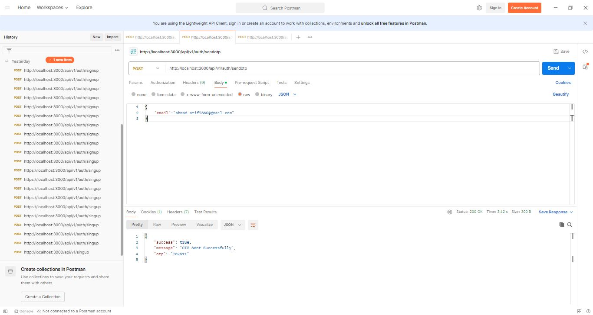
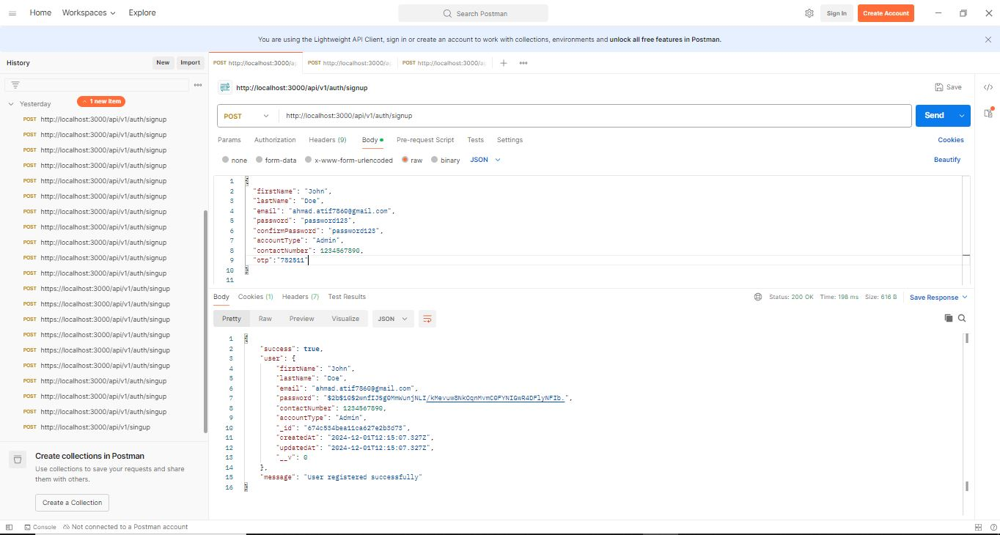
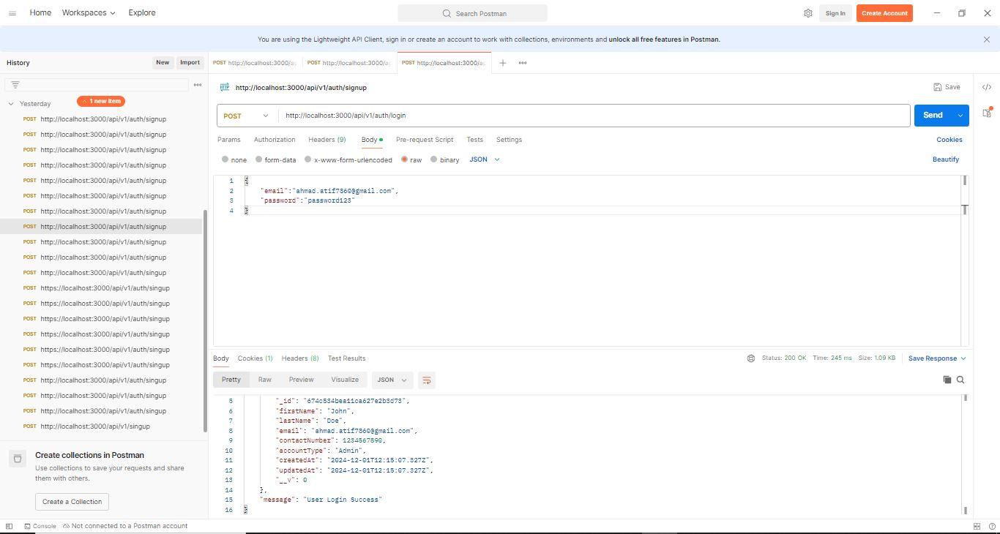

# Role-Based Authentication System

This project implements a role-based authentication system that includes email-based OTP verification, user registration, and login functionality. The system allows users to register and log in with different roles (Admin, Student, and Instructor). JWT (JSON Web Tokens) is used for authentication and secure access control.

## Features
- **Email-based OTP Generation**: Users can request an OTP to verify their email during registration.
- **Role-Based Registration**: Users can register as one of three roles: `Admin`, `Student`, or `Instructor`.
- **OTP Verification**: Users must verify the OTP received on their email before proceeding with registration.
- **JWT Authentication**: Users can log in and receive a JWT token for secure access to protected routes.

## Tech Stack
- **Backend**: Node.js, Express.js
- **Database**: MongoDB
- **Authentication**: JSON Web Tokens (JWT)
- **Email Service**: Nodemailer (for OTP emails)
- **Environment Variables**: `.env` file for sensitive information like JWT secret and MongoDB URI

## Project Structure

```
project/
├── config/
│   └── config.js                # Configuration for database connection and environment variables
├── controllers/
│   └── Auth.js                  # Authentication logic for signup, login, and OTP verification
├── middlewares/
│   └── auth.js                  # Middleware to protect routes by verifying JWT tokens
│   └── demo.js                  # Sample middleware (for testing or logging)
├── models/
│   └── OTP.js                   # OTP model for storing OTP data
│   └── User.js                  # User model for storing user data
├── node_modules/                # Installed Node.js dependencies
├── routes/
│   └── User.js                  # API routes for user authentication and actions
├── utils/
│   └── mailSender.js            # Utility to send OTP emails using Nodemailer
├── .env                          # Environment variables (JWT_SECRET, DB_URI, etc.)
├── package-lock.json             # Locks versions of project dependencies
├── package.json                  # Project dependencies and metadata
└── server.js                     # Main server file where routes are set up and the app listens for requests
```

## Installation

### Backend Setup

1. **Clone the repository**:
   ```bash
   git clone https://github.com/your-username/rolebased-auth-system.git
   cd rolebased-auth-system
   ```

2. **Install dependencies**:
   ```bash
   npm install
   ```

3. **Configure environment variables**:
   Create a `.env` file in the root directory and add the following:
   ```plaintext
   MONGODB_URL
   PORT
   MAIL_HOST
   MAIL_USER
   MAIL_PASS
   JWT_SECRET
   
   ```
   Make sure to replace `your_jwt_secret` with a secret key of your choice and `your_mongo_db_uri` with your MongoDB connection URI.

4. **Start the server**:
   ```bash
   npm start
   ```
   The server will start on `http://localhost:3000`.

## API Endpoints

### 1. **Send OTP**
- **Route**: `POST /api/v1/auth/send-otp`
- **Body**: 
   ```json
   {
     "email": "user@example.com"
   }
   ```
- **Response**:
   ```json
   {
     "success": true,
     "message": "OTP sent to your email."
   }
   ```
   


### 2. **User Registration**
- **Route**: `POST /api/v1/auth/signup`
- **Body**:
   ```json
   {
     "firstName": "John",
     "lastName": "Doe",
     "email": "user@example.com",
     "password": "password123",
     "confirmPassword": "password123",
     "accountType": "Student",
     "contactNumber": "1234567890",
     "otp":"000000"
   }
   ```
- **Response**:
   ```json
   {
     "success": true,
     "message": "User registered successfully."
   }
   ```

    

### 3. **User Login**
- **Route**: `POST /api/v1/auth/login`
- **Body**:
   ```json
   {
     "email": "user@example.com",
     "password": "password123"
   }
   ```
- **Response**:
   ```json
   {
     "success": true,
     "token": "jwt_token_here"
   }
   ```
  

## Folder Details

### **Backend**
- **controllers/Auth.js**: Contains logic for OTP generation, OTP verification, user registration, and login.
- **routes/User.js**: Defines the API routes for user actions such as signup, login, and OTP verification.
- **models/OTP.js**: Defines the structure of the OTP model, which stores OTP data in the database.
- **models/User.js**: Defines the structure of the user model, which stores user-related information such as name, email, password, and account type.
- **middlewares/auth.js**: Protects routes by checking for a valid JWT token before granting access.
- **utils/mailSender.js**: Contains functions to send OTP emails using a service like Nodemailer.

## License

This project is licensed under the MIT License - see the [LICENSE](LICENSE) file for details.

---
